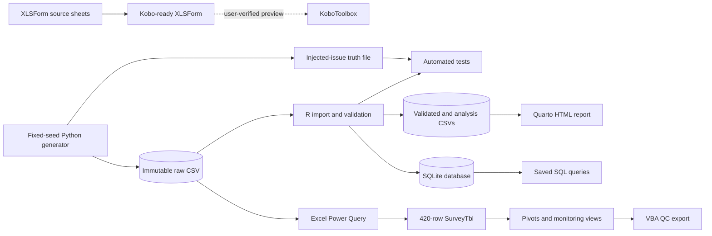
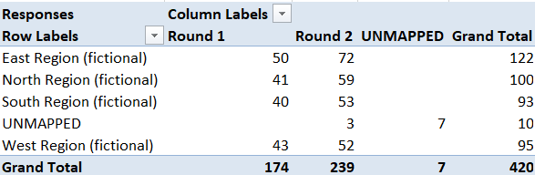
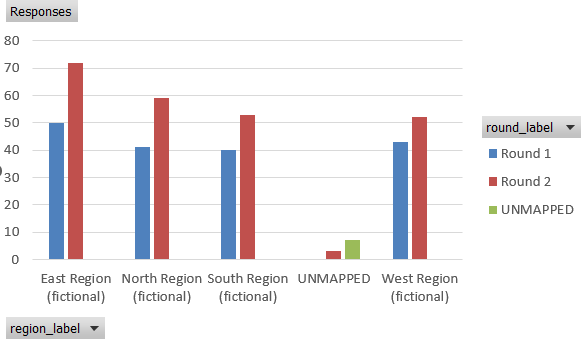
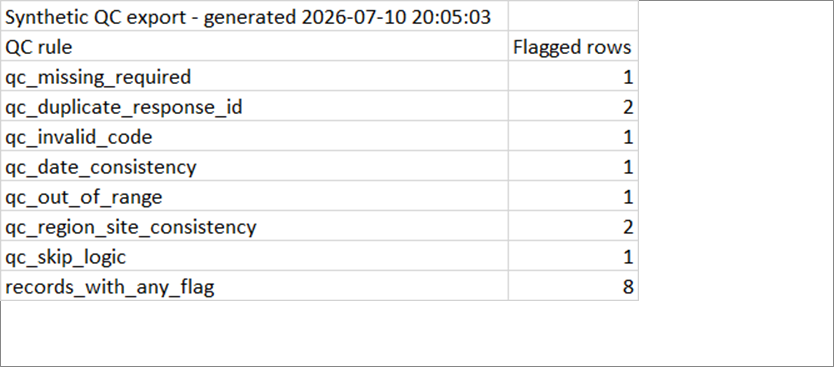
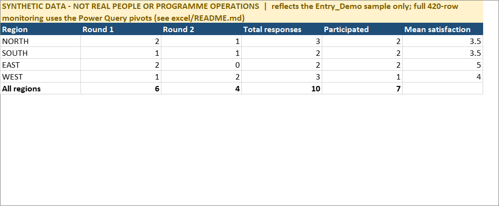
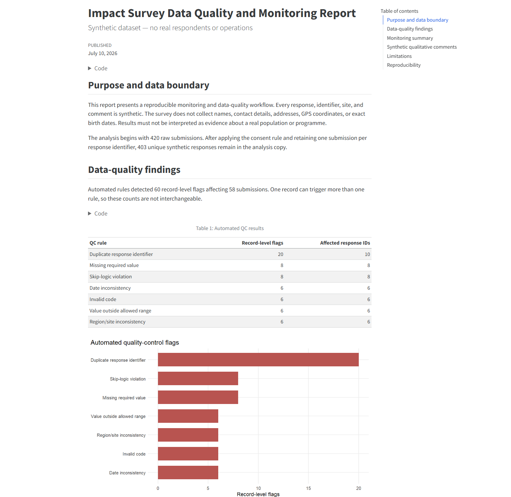

<div align="center">

# Impact Survey Data Quality & Reporting Toolkit

### Survey data quality from collection to reporting

I built this toolkit around a fictional community training follow-up survey. It
starts with the XLSForm, follows the data through quality checks and analysis,
and finishes with an R report, a queryable database, and an Excel monitoring
workbook.

[](docs/synthetic_data_design.md)
[](requirements.txt)
[](renv.lock)
[](excel/README.md)
[](docs/verification/)
[](LICENSE)

**[Download the HTML report](reports/impact_survey_report.html) ·
[Download the verified Excel workbook](excel/impact_survey_monitoring.xlsm) ·
[Open the Kobo-ready XLSForm](survey/impact_survey_xlsform.xlsx) ·
[See the interview walkthrough](docs/interview_guide.md)**

</div>

> [!IMPORTANT]
> All data in this repository is synthetic. No record represents a real person,
> organisation, programme, or field operation.

## Project at a glance

| 420 synthetic responses | 7 automated QC rules | 60 record-level flags | 4 integrated tool layers |
|---:|---:|---:|---:|
| Fixed-seed generation | Missing, duplicate, code, date, range, consistency, skip logic | Affecting 58 submissions | Kobo/XLSForm, Python, R/SQLite/Quarto, Excel |

The repository brings together tasks I would handle in a monitoring-data role:

- designing and testing a survey instrument;
- maintaining clear raw, interim, and processed data layers;
- detecting and documenting realistic data-quality problems;
- cleaning, analysing, querying, and reporting survey data in R and SQL;
- building operational Excel tools with Power Query, formulas, pivots, and VBA;
- writing procedures that make updates, decisions, and limitations auditable.

## What I built

| Component | Achievement | Evidence |
|---|---|---|
| **Survey collection** | Kobo-ready XLSForm with constraints, skip logic, cascading region/site choices, consent path, and qualitative questions | [XLSForm](survey/impact_survey_xlsform.xlsx) · [Git-friendly source sheets](survey/source/) · [Kobo verification](docs/verification/kobo_test_log.md) |
| **Synthetic monitoring data** | 420 deterministic responses generated with seed `20260710`, including a machine-readable injected-issue truth file | [Generator](scripts/generate_synthetic_data.py) · [Manifest](data/raw/generation_manifest.json) · [Data dictionary](data/data_dictionary.csv) |
| **R quality pipeline** | Character-first import, explicit typing, seven validation rules, cleaning audit, descriptive statistics, cross-tabulations, and qualitative theme coding | [R modules](R/) · [Pipeline](scripts/run_pipeline.R) · [R verification](docs/verification/r_test_log.md) |
| **Database and queries** | SQLite database with four tables, indexes, saved SQL, and a PowerShell-safe reconciliation script | [Database](data/processed/impact_survey_synthetic.sqlite) · [SQL](sql/common_queries.sql) · [Query guide](docs/query_guide.md) |
| **Automated reporting** | Self-contained Quarto HTML report with dynamic narrative, tables, limitations, and four charts | [Rendered report](reports/impact_survey_report.html) · [Quarto source](reports/impact_survey_report.qmd) |
| **Advanced Excel** | Verified `.xlsm` with a 420-row Power Query import, lookup labels, data validation, conditional formatting, 279 formulas, two pivots, and a VBA refresh/QC-export macro | [Workbook](excel/impact_survey_monitoring.xlsm) · [Power Query M](excel/power_query/SurveyRaw.m) · [VBA source](excel/vba/RefreshAndExportQC.bas) · [Excel verification](docs/verification/excel_test_log.md) |
| **Data management** | Data-flow diagram, quality procedure, versioning procedure, issue log, query instructions, and interview guide | [Documentation index](#documentation) |

## Workflow and architecture



I keep the raw data immutable. Automated rules identify problems, while
cleaning decisions are applied only to a documented analysis copy. That keeps
the original evidence intact and makes every reported result reproducible.

## Visual evidence

The images below were captured from the tested local artifacts, not created as
mock-ups. See [screenshot provenance](docs/screenshots/README.md).

<table>
  <tr>
    <td width="50%">
      
      <br><strong>Region × round pivot table</strong><br>
      The Power Query import reconciles to all 420 synthetic submissions.
    </td>
    <td width="50%">
      
      <br><strong>Region × round chart</strong><br>
      A quick visual comparison of coverage across regions and survey rounds.
    </td>
  </tr>
  <tr>
    <td width="50%">
      
      <br><strong>VBA QC export</strong><br>
      The macro refreshes workbook objects and exports rule-level QC counts.
    </td>
    <td width="50%">
      
      <br><strong>Monitoring summary</strong><br>
      Key response and data-quality indicators in one compact worksheet.
    </td>
  </tr>
</table>

### Automated HTML report



## Data-quality rules

| Rule | Example problem detected | Analysis treatment |
|---|---|---|
| Missing required | Region, site, age group, or conditional training value is blank | Retain the flag; exclude the missing value from its denominator |
| Duplicate identifier | Two submissions share one intended-unique response ID | Keep one documented copy in the analysis dataset |
| Invalid code | Value is outside an approved choice list | Set the invalid code to missing in the analysis copy |
| Date consistency | Activity starts after interview, or training falls outside the valid sequence | Retain and flag for source review |
| Out of range | Household size, score, or duration exceeds documented limits | Set the invalid numeric value to missing in the analysis copy |
| Region/site consistency | Site does not belong to the selected region | Retain both raw codes and flag the conflict |
| Skip logic | Training or follow-up fields are populated when the parent answer is `no` | Retain raw evidence and exclude the inapplicable answer from interpretation |

Detected categories can overlap. For example, an invalid region can also produce
a region/site inconsistency. The project therefore reports both total flags and
distinct affected submissions.

## Synthetic findings

These values come from the generated dataset. They show what the reporting
layer produces, but they are not findings about a real population or programme.

| Indicator | Result |
|---|---:|
| Raw synthetic submissions | 420 |
| Consented submissions | 413 |
| Unique consented responses used for analysis | 403 |
| Submissions with at least one QC issue | 58 |
| Total record-level QC flags | 60 |
| Synthetic training participation | 75.7% |
| Mean valid satisfaction | 3.85 / 5 |
| Skill use among synthetic training participants | 64.3% |
| Synthetic qualitative comments coded | 72 |

The qualitative component assigns the 72 non-empty synthetic comments to four
transparent themes. Positive-learning comments form the largest group at
43.1%. I kept the method simple and inspectable; it is not presented as
generalisable qualitative research.

## Verification

I only marked a component complete after running it and recording the result.

| Check | Verified result |
|---|---|
| Python suite | **18 tests passed**, including deterministic builds and final `.xlsm` package checks |
| XLSForm | **pyxform 4.5.0 structural validation passed** |
| KoboToolbox | Upload, preview, constraints, cascading choices, and skip paths **user-verified** |
| R suite | **8 test blocks / 22 expectations passed** |
| SQLite | Four tables and saved query patterns reconciled; clean rebuild hash is deterministic |
| Quarto | Self-contained HTML report rendered with four embedded charts |
| Excel | 420-row import, two pivots, formula flags, validation, conditional formatting, and VBA export verified |
| Controlled refresh | Disposable source changed query and pivot totals **420 → 419 → 420** |
| Privacy audit | Public `.xlsm` contains no local user path or personal author metadata |

Detailed logs:

- [Automated Python and XLSForm checks](docs/verification/automated_test_log.md)
- [R, SQLite, and Quarto checks](docs/verification/r_test_log.md)
- [KoboToolbox test log](docs/verification/kobo_test_log.md)
- [Excel test and publication audit](docs/verification/excel_test_log.md)

## Reproduce the project

### 1. Python: regenerate data and survey artifacts

```powershell
python -m venv --system-site-packages .venv
.\.venv\Scripts\python.exe -m pip install -r requirements.txt
.\.venv\Scripts\python.exe scripts\generate_synthetic_data.py
.\.venv\Scripts\python.exe scripts\build_xlsform.py
.\.venv\Scripts\python.exe scripts\build_excel_template.py
.\.venv\Scripts\python.exe -m pytest
.\.venv\Scripts\python.exe scripts\validate_xlsform.py
```

### 2. R and SQLite: run the pipeline and tests

Install R 4.6.1 and Quarto, then run:

```powershell
Rscript -e "if (!requireNamespace('renv', quietly = TRUE)) install.packages('renv', repos = 'https://cloud.r-project.org')"
Rscript -e "renv::restore(prompt = FALSE)"
Rscript scripts/run_pipeline.R
Rscript tests/testthat.R
Rscript scripts/check_database.R
```

### 3. Quarto: render the report

```powershell
quarto render reports/impact_survey_report.qmd
```

### 4. Excel: refresh the verified workbook

Open `excel/impact_survey_monitoring.xlsm`, set `Config!B3` (`RawDataPath`) to
the full local path of `data/raw/survey_responses_synthetic.csv`, and choose
**Data → Refresh All**. See the [Excel build and review guide](excel/README.md)
for the Power Query, pivot, and VBA steps.

## Repository structure

```text
data/
  raw/             immutable synthetic extract, truth file, manifest
  interim/         disposable pipeline working layer
  processed/       validated data, analysis data, QC outputs, SQLite
survey/
  source/          diffable XLSForm survey, choices, and settings sheets
  impact_survey_xlsform.xlsx
excel/
  power_query/     exported M source
  vba/             exported VBA source
  examples/        curated verified macro output
  impact_survey_monitoring_template.xlsx
  impact_survey_monitoring.xlsm
R/                 import, validation, cleaning, summary, database modules
reports/           Quarto source, self-contained HTML, figures
sql/               saved monitoring queries
scripts/           reproducible entry points and artifact builders
tests/             Python and R validation tests
docs/              procedures, diagrams, verification logs, screenshots
```

## Documentation

| Document | Purpose |
|---|---|
| [Data-flow diagram](docs/data_flow.md) | Explains movement and controls from survey/raw data to reporting |
| [Data-quality procedure](docs/data_quality_procedure.md) | Receive, validate, triage, resolve, reconcile, and release |
| [Update and versioning procedure](docs/update_and_versioning.md) | Defines immutable inputs, Git boundaries, updates, and rollback |
| [Data dictionary](data/data_dictionary.csv) | Defines fields, types, valid values, and conditional requirements |
| [Query guide](docs/query_guide.md) | Shows how to answer and document common monitoring questions |
| [Synthetic-data design](docs/synthetic_data_design.md) | Documents seed, boundaries, injections, and qualitative phrases |
| [Excel guide](excel/README.md) | Rebuilds and reviews Power Query, pivots, formulas, and VBA |
| [Interview walkthrough](docs/interview_guide.md) | Provides a concise, evidence-based project explanation |

## Key design decisions

- **Immutable raw data:** I preserve the received evidence and make every
  downstream change traceable.
- **Injected-issue truth file:** the tests can prove that known problems were
  detected instead of merely producing plausible-looking counts.
- **Separate validated and analysis datasets:** detecting a problem and deciding
  how to treat it analytically are different decisions, so I keep both visible.
- **QC in both R and Excel:** R provides reproducible, dataset-wide validation;
  Excel provides a familiar operational interface for monitoring staff.
- **M and VBA stored as text:** binary workbooks are difficult to review in Git,
  so I version the implementation sources separately.

## Scope and limitations

- All people, sites, responses, comments, and apparent findings are synthetic.
- KoboToolbox was tested in preview; no live deployment or field collection is
  claimed.
- The public `.xlsm` retains verified cached outputs but uses a sanitized
  `RawDataPath` placeholder that must be configured locally before refresh.
- Excel pivots are backed by the loaded worksheet table; no Excel Data Model or
  slicers are claimed.
- Synthetic qualitative comments come from a small phrase library, so the theme
  results show how the method works rather than supporting real inference.
- For duplicate resolution in this dataset, I keep the first submission ID in
  lexical order. With real data, I would confirm that decision with the data
  owner.

## License

The code and documentation are available under the [MIT License](LICENSE).
