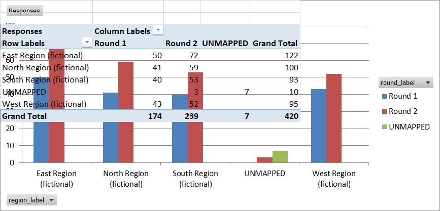

# Impact Survey Data Quality and Reporting Toolkit

> **Portfolio project using synthetic data only.** No record represents a real
> person, programme, organisation, or field operation.

This complete portfolio demonstration presents a reproducible
monitoring-data workflow spanning XLSForm survey design, deliberate data-quality
problems, R validation and reporting, SQLite queries, and an Excel monitoring
workbook. The fictional case is a community-services and training follow-up
survey; it is not connected to a real organisation.

## Current verified status

The status table is updated only after evidence-producing checks are run.

| Component | Status |
|---|---|
| Synthetic-data generator, survey, and Excel build | **Tested:** 420 rows; 18 Python tests passed |
| XLSForm local structural validation | **Passed:** pyxform 4.5.0 |
| KoboToolbox preview and logic test | **Passed:** user-verified preview and logic paths |
| R pipeline and automated tests | **Passed:** R 4.6.1; 8 test blocks / 22 expectations; user rerun |
| SQLite database and saved queries | **Tested:** four tables and common query patterns |
| Quarto HTML report | **Rendered:** Quarto 1.9.38; four embedded charts |
| Excel Power Query, pivots, and VBA | **Tested:** Excel 16.0.20131; 420-row query import, two pivots reconciled, VBA QC export verified |

See [`docs/verification/automated_test_log.md`](docs/verification/automated_test_log.md)
and [`docs/verification/r_test_log.md`](docs/verification/r_test_log.md) for
commands and observed results. Kobo and Excel have separate application-level
verification logs; the Excel checkpoint results are recorded in
[`docs/verification/excel_test_log.md`](docs/verification/excel_test_log.md).

## Architecture

The generator writes immutable synthetic raw data and an injection-truth file.
The R pipeline parses and validates every raw record, writes a long issue log
and a deduplicated analysis copy, populates SQLite, creates four charts, and
feeds the Quarto report. Excel independently imports the raw extract through
Power Query and exposes operational QC and monitoring views. See
[`docs/data_flow.md`](docs/data_flow.md).

## Reproduce the completed Day 1 components

From PowerShell in the repository root:

```powershell
python -m venv --system-site-packages .venv
.\.venv\Scripts\python.exe -m pip install -r requirements.txt
.\.venv\Scripts\python.exe scripts\generate_synthetic_data.py
.\.venv\Scripts\python.exe scripts\build_xlsform.py
.\.venv\Scripts\python.exe -m pytest
.\.venv\Scripts\python.exe scripts\validate_xlsform.py
```

The generated manifest records fixed seed `20260710`, the expected row count,
issue counts, and the raw CSV SHA-256 hash.

## Run the R pipeline and report

Install R 4.6.1 and Quarto, then run from the repository root:

```powershell
Rscript -e "if (!requireNamespace('renv', quietly = TRUE)) install.packages('renv', repos = 'https://cloud.r-project.org')"
Rscript -e "renv::restore(prompt = FALSE)"
Rscript scripts/run_pipeline.R
Rscript tests/testthat.R
Rscript scripts/check_database.R
quarto render reports/impact_survey_report.qmd
```

The exact R dependency versions are recorded in `renv.lock`. The final report
is [`reports/impact_survey_report.html`](reports/impact_survey_report.html).

## Build the Excel monitoring template

The workbook is generated deterministically, like the XLSForm:

```powershell
.\.venv\Scripts\python.exe scripts\build_excel_template.py
```

This writes [`excel/impact_survey_monitoring_template.xlsx`](excel/impact_survey_monitoring_template.xlsx),
whose `Entry_Demo` sheet works with no wiring. The tested macro-enabled artifact
is [`excel/impact_survey_monitoring.xlsm`](excel/impact_survey_monitoring.xlsm).
Its cached table and pivots contain the verified 420-row synthetic extract; set
`RawDataPath` on the Config sheet to a local full path before refreshing. Build,
review, and macro instructions are in [`excel/README.md`](excel/README.md).

## Synthetic findings

These figures demonstrate reporting logic; they do not describe a real
population or programme.

- 420 raw submissions and 413 consented submissions were generated.
- 403 unique consented response IDs remain after duplicate handling.
- 58 submissions have at least one QC flag, producing 60 record-level flags.
- Duplicate detection produces 20 flags across ten repeated response IDs.
- Synthetic training participation is 75.7%; mean valid satisfaction is 3.85
  out of 5; reported skill use among participants is 64.3%.
- All 72 non-empty synthetic comments were assigned to one of four transparent
  themes; positive-learning comments are the largest group at 43.1%.

The issue counts overlap by design: for example, an invalid region or site can
also trigger a region/site consistency rule.

## Current data-quality scenarios

The raw extract intentionally includes missing required values, duplicate
response identifiers, invalid codes, inconsistent dates, out-of-range values,
region/site inconsistencies, and skip-logic violations. These are test inputs,
not mistakes that should be silently repaired in the raw layer.

## Repository map

- `data/raw/`: immutable synthetic generator outputs and manifest
- `data/interim/`: disposable pipeline working files
- `data/processed/`: tested analysis, QC, summary, and SQLite outputs
- `R/`: small modules for import, validation, cleaning, summaries, and database output
- `reports/`: Quarto source, rendered HTML, and generated charts
- `sql/`: tested common monitoring queries
- `survey/source/`: diffable survey, choice, and settings sheets
- `survey/impact_survey_xlsform.xlsx`: generated Kobo-ready workbook
- `excel/`: generated template, verified `.xlsm`, Power Query/VBA sources, and build guide
- `scripts/`: generators, builders, and validators
- `tests/`: Python and R automated tests
- `docs/`: procedures, design decisions, diagrams, and verification evidence

## Data-management documentation

- [Data-flow diagram](docs/data_flow.md)
- [Data-quality procedure](docs/data_quality_procedure.md)
- [Dataset update and versioning procedure](docs/update_and_versioning.md)
- [Common query guide](docs/query_guide.md)
- [Excel workbook build guide](excel/README.md)
- [Interview walkthrough](docs/interview_guide.md)
- [Synthetic-data design](docs/synthetic_data_design.md)
- [Generated QC issue log](data/processed/qc_issues_synthetic.csv)

## Screenshots

All screenshots below come from tested local artifacts containing synthetic
data. Provenance is recorded in
[`docs/screenshots/README.md`](docs/screenshots/README.md).

### Excel region and round pivot — 420 imported rows



### VBA QC export


### Rendered Quarto report


## Limitations and incomplete work

- KoboToolbox upload, preview, constraints, cascading choices, and skip paths
  were user-verified; no live deployment or real data collection is claimed.
- The Excel workbook was assembled and exercised in Excel 16.0.20131 via COM
  automation: the Power Query import loads 420 rows, both pivots reconcile
  (grand total 420), a controlled refresh changed the table and pivot to 419
  before restoring both to 420, and the VBA macro exports the expected QC
  counts. The pivots use the loaded `SurveyTbl` table rather than an Excel Data
  Model, and slicers are not included. See
  [`docs/verification/excel_test_log.md`](docs/verification/excel_test_log.md).
- The public `.xlsm` is sanitized and retains verified cached outputs. A
  reviewer must set the Config-sheet `RawDataPath` to a local full path before
  refreshing Power Query.
- The qualitative comments come from a small synthetic phrase library. The
  keyword themes demonstrate a transparent workflow, not generalisable
  qualitative research.
- Duplicate handling retains the first submission ID in lexical order. A real
  project would require a documented confirmation from the data owner.
