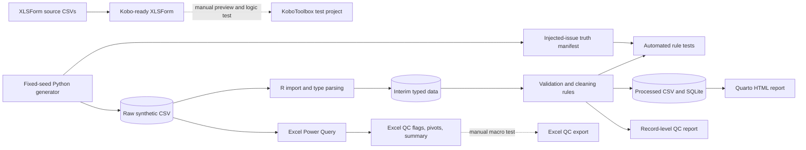

# Data-flow and control points

All records shown in this flow are synthetic. Raw data is immutable; interim
data is disposable; processed data is reproducible and analysis-ready.

## Control points

1. The generator fixes the random seed, dates, row count, and output order.
2. Raw files are checksummed and never edited by R or Excel.
3. The truth manifest is used for tests, not as an input to analytical results.
4. R validation produces record-level flags before exclusion or correction.
5. Excel independently exposes operational QC views from the raw extract.
6. Kobo, R/Quarto, and Excel receive separate verification logs; passing one
   checkpoint does not imply that another component works.

