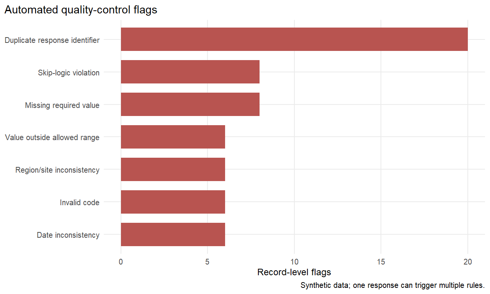
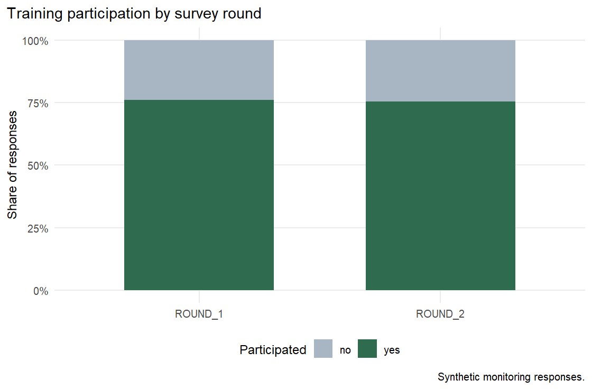
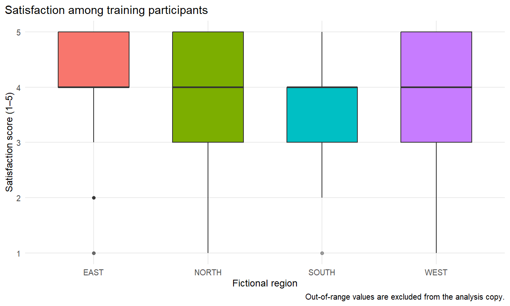
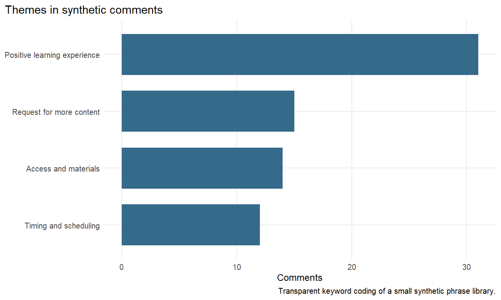

```{r}
#| label: setup
source(file.path("R", "bootstrap.R"))
bootstrap_project_library()
Sys.setenv(IMPACT_PROJECT_ROOT = normalizePath(getwd(), winslash = "/"))
library(dplyr)
library(readr)
library(knitr)

processed <- file.path("data", "processed")
headline <- read_csv(
  file.path(processed, "headline_metrics_synthetic.csv"),
  show_col_types = FALSE
)
issue_summary <- read_csv(
  file.path(processed, "qc_issue_summary_synthetic.csv"),
  show_col_types = FALSE
)
region_round <- read_csv(
  file.path(processed, "region_round_summary_synthetic.csv"),
  show_col_types = FALSE
)
gender_participation <- read_csv(
  file.path(processed, "gender_participation_synthetic.csv"),
  show_col_types = FALSE
)
qualitative_summary <- read_csv(
  file.path(processed, "qualitative_theme_summary_synthetic.csv"),
  show_col_types = FALSE
)
qualitative_comments <- read_csv(
  file.path(processed, "qualitative_comments_coded_synthetic.csv"),
  show_col_types = FALSE
)

metric_value <- function(metric_name) {
  headline$value[headline$metric == metric_name][[1]]
}
```

## Purpose and data boundary

This report demonstrates a reproducible monitoring and data-quality workflow.
Every response, identifier, site, and comment is synthetic. The survey does not
collect names, contact details, addresses, GPS coordinates, or exact birth
dates. Results must not be interpreted as evidence about a real population or
programme.

The analysis begins with `r metric_value("Raw submissions")` raw submissions.
After applying the consent rule and retaining one submission per response
identifier, `r metric_value("Unique consented responses used for analysis")`
unique synthetic responses remain in the analysis copy.

## Data-quality findings

Automated rules detected `r metric_value("Total record-level QC flags")`
record-level flags affecting
`r metric_value("Responses with one or more QC flags")` submissions. One record
can trigger more than one rule, so these counts are not interchangeable.

```{r}
#| label: tbl-qc-summary
#| tbl-cap: "Automated QC results"
issue_summary |>
  select(issue_label, flag_count, affected_response_ids) |>
  rename(
    `QC rule` = issue_label,
    `Record-level flags` = flag_count,
    `Affected response IDs` = affected_response_ids
  ) |>
  kable(digits = 1)
```

{#fig-qc}

Flags remain visible in the validated dataset. The analysis copy keeps one
record per response identifier, converts invalid codes and out-of-range numeric
values to missing, and uses rule-specific denominators. Raw values are never
overwritten.

## Monitoring summary

The synthetic training participation rate is
`r scales::percent(metric_value("Training participation rate"), accuracy = 0.1)`.
Among participants with a valid rating, mean satisfaction is
`r round(metric_value("Mean satisfaction among valid training responses"), 2)`
on a five-point scale. The reported skill-use rate is
`r scales::percent(metric_value("Skill-use rate among training participants"), accuracy = 0.1)`.

{#fig-participation}

```{r}
#| label: tbl-region-round
#| tbl-cap: "Monitoring indicators by fictional region and round"
region_round |>
  mutate(
    participation_rate = scales::percent(participation_rate, accuracy = 0.1),
    mean_satisfaction = round(mean_satisfaction, 2),
    mean_service_access = round(mean_service_access, 2)
  ) |>
  rename(
    Region = region_code,
    Round = survey_round,
    Responses = responses,
    Participants = training_participants,
    `Participation rate` = participation_rate,
    `Mean satisfaction` = mean_satisfaction,
    `Mean service access` = mean_service_access,
    `Follow-up requests` = follow_up_requests
  ) |>
  kable()
```

{#fig-satisfaction}

### Cross-tabulation

```{r}
#| label: tbl-gender-participation
#| tbl-cap: "Training participation by gender category"
gender_participation |>
  rename(
    Gender = gender,
    Participated = participated_training,
    Responses = responses,
    `Percent within gender` = percent_within_gender
  ) |>
  kable()
```

## Synthetic qualitative comments

The optional comments come from a documented synthetic phrase library. A
transparent keyword rule assigns one theme to each comment. This is useful for
demonstrating data management and reporting, but it is not a substitute for
iterative human coding of real qualitative data.

```{r}
#| label: tbl-qualitative-themes
#| tbl-cap: "Themes in synthetic open comments"
qualitative_summary |>
  rename(
    Theme = theme,
    Comments = comment_count,
    `Percent of comments` = percent_of_comments
  ) |>
  kable()
```

{#fig-qualitative}

Representative synthetic examples are shown only to make the coding method
auditable:

```{r}
#| label: tbl-comment-examples
#| tbl-cap: "One synthetic example per assigned theme"
qualitative_comments |>
  group_by(theme) |>
  slice_head(n = 1) |>
  ungroup() |>
  select(theme, open_comment) |>
  rename(Theme = theme, `Synthetic example` = open_comment) |>
  kable()
```

## Limitations

- The data-generating assumptions determine every apparent pattern.
- Deliberate errors are more structured than errors in most live systems.
- Duplicate handling keeps the first submission identifier for demonstration;
  a real project would confirm the resolution with the data owner.
- Invalid and out-of-range values are set to missing only in the analysis copy.
- Theme coding is based on a small synthetic phrase library and is not suitable
  for inference.
- Excel and KoboToolbox have separate manual verification requirements and are
  not validated by this report.

## Reproducibility

From the repository root, restore dependencies, run the pipeline and tests,
then render this report:

```text
Rscript -e "renv::restore(prompt = FALSE)"
Rscript scripts/run_pipeline.R
Rscript tests/testthat.R
quarto render reports/impact_survey_report.qmd
```
